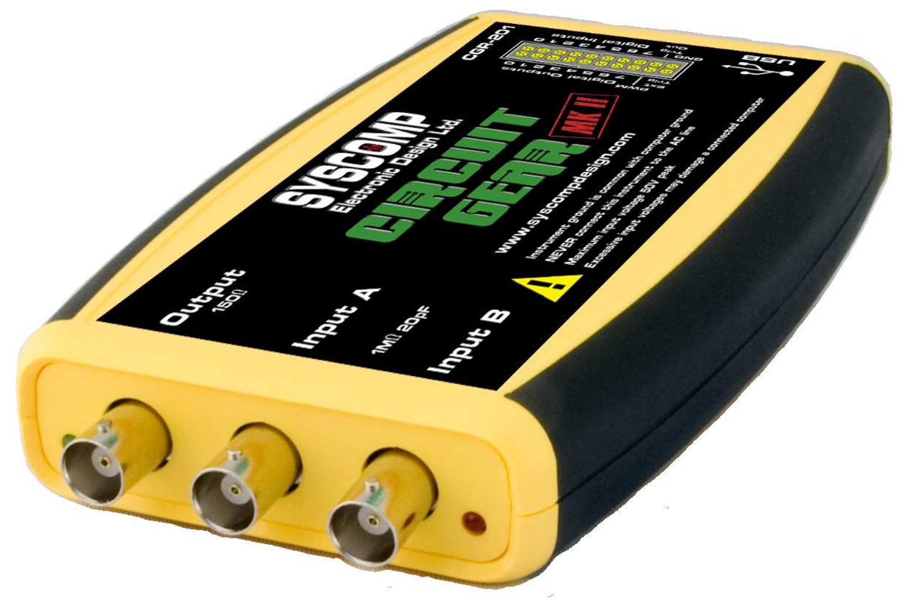

# Yelloscope #

My fork of Syscomp Design's (defunct) software for their USB Oscilloscopes.



<!-- markdown-toc start - Don't edit this section. Run M-x markdown-toc-refresh-toc -->
**Table of Contents**

- [Yelloscope](#yelloscope)
  - [Installing](#installing)
    - [From source](#from-source)
      - [Linux (Ubuntu)](#linux-ubuntu)
  - [Documentation](#documentation)
  - [Firmware hex files](#firmware-hex-files)
  - [Sample waveforms for the arbitrary waveform generator](#sample-waveforms-for-the-arbitrary-waveform-generator)

<!-- markdown-toc end -->

## Installing ##

### From source ###

#### Linux (Ubuntu) ####

1. Clone the repository

```
git clone https://github.com/johnpeck/yelloscope.git
```

2. Install prerequisites

```
sudo apt install tcllib libtk-img bwidget tk-table
```

3. Start the software

```
cd yelloscope/src
tclsh main.tcl
```

## Documentation ##

The CGR-201 operating manual is [here](doc/CGR-201-Manual.pdf).

CGR-201 commands are documented [here](doc/CGR-201-Command-List.pdf).

Notes on using CGR oscilloscopes as network analyzers and lock-in
amplifiers are [here](doc/na-theory.pdf).

The SIG-101 Signature Analyzer operating manual is [here](doc/SIG101-manual.pdf).

The CircuitGear Mini (CGM-101) operating manual is [here](doc/CGM101-manual.pdf).

Wavemaker software for the WGM-101 is described [here](doc/waveMakerManual.pdf).

## Firmware hex files ##

Each supported device (CGM-101, CGR-201, and SIG-101) contains a
microcontroller and an FPGA.  Firmware for the individual
microcontrollers is in `src/Firmware`.

## Sample waveforms for the arbitrary waveform generator ##

Look for waveform examples in `doc/example_waveforms`.

